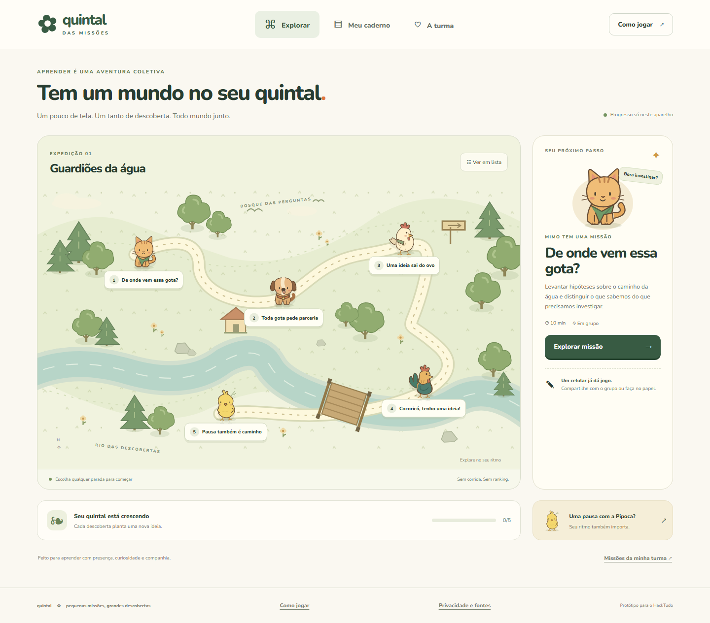
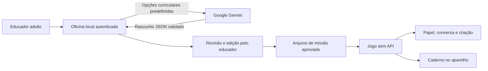

<p align="center"></p>
<h1 align="center">Quintal das Missões</h1>
<p align="center"><strong>Um pouco de tela. Um tanto de descoberta. Todo mundo junto.</strong></p>
<p align="center">RPG cooperativo de aprendizagem • Protótipo HackTudo • Gemini na oficina do educador</p>



O celular abre a missão. A aprendizagem continua na conversa, no papel e na observação do mundo.

O **Quintal das Missões** transforma uma atividade de aula em uma pequena expedição cooperativa. Um gato puxa a pergunta, um cachorro organiza a parceria, uma galinha convida a criar, um galo abre a roda e um pintinho lembra que a pausa também faz parte. A turma pode compartilhar um aparelho ou participar inteiramente no papel.

O Gemini atua em uma **oficina separada para o educador adulto**. Ele prepara um rascunho curricular. O educador revisa, edita e exporta a atividade. O jogo recebe apenas o arquivo aprovado e não acessa a API.

## O desafio que orienta o projeto

Como permitir o uso pedagógico de dispositivos pessoais, reduzindo distrações e fortalecendo foco, autonomia e mediação, sem ampliar vigilância, desigualdade ou sobrecarga?

A resposta do Quintal é uma rotina simples: **combinar, explorar, sair da tela, compartilhar e refletir**. O jogo não bloqueia outros aplicativos e não tenta medir atenção. A proposta é tornar o propósito do uso do aparelho claro e dar ao grupo um próximo passo fora dele.

## Experimente em dois minutos

Requisito: **Node.js 22 ou superior**. O jogo não tem dependências de execução.

```sh
git clone https://github.com/SouBeatrizKaroline/quintal-das-missoes-hacktudo.git
cd quintal-das-missoes-hacktudo
npm start
```

Abra **http://localhost:3000**. Escolha qualquer parada e siga as três etapas. É possível avançar antes do relógio, pausar ou voltar. Ao final, plante uma descoberta no caderno.

O repositório é privado, então o clone exige acesso à conta ou permissão de colaboração. No PowerShell, use `npm.cmd` no lugar de `npm` se a política local bloquear scripts `.ps1`.

### Oficina com Gemini

```sh
npm run setup
```

Abra o arquivo `.env` criado localmente. Configure `GEMINI_API_KEY` com sua chave do Google AI Studio e mantenha `GEMINI_MODEL=gemini-3.6-flash`. O comando também gera uma senha exclusiva em `TEACHER_TOKEN`, sem exibi-la.

Em outro terminal:

```sh
npm run teacher
```

Abra **http://localhost:3001**. Informe a senha `TEACHER_TOKEN` na oficina, escolha componente, tema, ano, duração e disponibilidade de aparelhos. Confirme que é educador adulto. Gere, revise e baixe a missão. No jogo, abra **Missões da minha turma** e selecione o JSON.

**A chave Gemini não é a senha da oficina.** Nenhuma das duas deve ser colocada em código, commits, capturas de tela ou arquivos de missão. `.env` é ignorado pelo Git. O clone inclui somente `.env.example`, sem credenciais.

O modelo 3.6 Flash foi verificado em uma chamada real em 12/09/2026, retornando uma missão estruturada de três etapas. Disponibilidade, cotas e cobrança dependem do projeto Google. Modelos são configuráveis e podem mudar. A integração usa o endpoint REST `generateContent`, documentado pelo Google como API legada; uma migração para Interactions pode ser necessária no futuro.

## O que já funciona

| Experiência | Comportamento entregue |
| --- | --- |
| Mapa RPG | Cinco paradas livres, personagens próprios, versão em lista e interface responsiva |
| Missões | Objetivo, materiais, três etapas, alternativa em papel e reflexão |
| Ritmo | Relógio voluntário com pausa, retomada e avanço livre, sem punição |
| Cooperação | Papéis rotativos e troca de ideias com participação oral ou por desenho |
| Caderno | Reflexões locais, download de texto e armazenamento persistente apenas se ativado |
| Inclusão | Um aparelho por grupo ou atividade impressa com o mesmo objetivo |
| Sem internet | Jogo e fontes em cache após o primeiro carregamento completo |
| Gemini | Geração real na oficina local do educador, com autenticação e revisão humana |
| Continuidade | Exportação e importação de missão em JSON validado |
| Impressão | Roteiros completos para uma missão ou para toda a expedição |

Não há cadastro de estudante, ranking, sequência diária, anúncios, câmera, microfone, geolocalização, análise comportamental, punição por trocar de aba ou correção automática de alunos por IA.

## Conheça a turma

| Personagem | Papel | Convite |
| --- | --- | --- |
| Mimo, o gato | Investigar | Fazer uma pergunta e reconhecer uma dúvida |
| Bento, o cachorro | Colaborar | Distribuir a fala e construir um acordo |
| Cora, a galinha | Criar | Transformar uma ideia em rascunho |
| Zeca, o galo | Compartilhar | Explicar uma escolha e ouvir outra pessoa |
| Pipoca, o pintinho | Cuidar | Perceber o ritmo e fazer uma pausa |

A expedição pronta, **Guardiões da água**, propõe perguntas sobre origem, consumo consciente e comunicação. As situações são exemplos didáticos, sem promessa de ganho de aprendizagem ou resultado de piloto.

## Arquitetura que mantém o estudante fora da API



São dois servidores e duas superfícies independentes. A oficina é vinculada a `127.0.0.1`, protegida por senha e não é linkada no jogo. Só o educador adulto deve ter acesso ao processo e ao computador da oficina. O JSON revisado é uma transferência manual; `reviewed: true` registra uma declaração de revisão, não uma assinatura ou verificação de identidade.

Essa separação considera as restrições etárias dos [termos da API Gemini](https://ai.google.dev/gemini-api/terms). Não torna um futuro serviço escolar automaticamente autorizado. Qualquer implantação real exige avaliação dos termos vigentes e do contexto da instituição.

## Verificação

```sh
npm ci
npm run check
npm test
npx playwright install chromium
npm run test:e2e
```

Os testes cobrem validação de missões, proteção da chave, erros do provedor, jornada de aprendizagem, caderno, exclusão local, revisão e importação, impressão, offline, viewport móvel e separação dos servidores. A integração real pode ser checada opcionalmente com `node --env-file=.env scripts/verify-gemini.mjs`; isso faz uma chamada ao Google e pode consumir cota. Os testes automatizados e o GitHub Actions não usam chave real.

## Estrutura

```text
public/              Jogo, personagens SVG, fontes locais e cache offline
teacher/             Oficina exclusiva do educador adulto
src/                 HTTP seguro e integração Gemini
scripts/             Configuração, validação, arte e verificação opcional
tests/               Testes de regras e fluxos no navegador
docs/                Pedagogia, apresentação, fontes e arquitetura
server.js            Servidor do jogo, sem acesso à API
teacher-server.js    Servidor local da oficina
```

## Para apresentar e continuar

- [Roteiro de demonstração e pitch](docs/APRESENTACAO.md)
- [Desenho pedagógico e proposta de piloto](docs/PEDAGOGIA.md)
- [Arquitetura, operação e limites](docs/ARQUITETURA.md)
- [Fontes consultadas e decisões de design](docs/FONTES.md)
- [Privacidade e segurança](SECURITY.md)
- [Como contribuir](CONTRIBUTING.md)
- [Registro de validação](docs/VALIDACAO.md)

O **Dockerfile inclui apenas o jogo**, sem oficina e sem credenciais. Para executar: `docker build -t quintal .` e `docker run --rm -p 3000:3000 quintal`. O cache offline exige HTTPS ou localhost. Não sirva a raiz do repositório como pasta pública.

## Limites honestos

Este é um MVP funcional para demonstração, não uma plataforma escolar homologada. Não há sincronização entre aparelhos, salas em tempo real, contas, relatórios de turma ou validação empírica de impacto. A persistência depende do navegador e pode ser apagada por ele. A oficina precisa de internet para gerar com Gemini; a missão pronta continua disponível sem geração. A documentação descreve uma proposta de piloto, não resultados já obtidos.

Arte vetorial própria, reproduzível pelo script `scripts/make-art.mjs`. Fonte [Nunito](https://fonts.google.com/specimen/Nunito), distribuída localmente com [SIL OFL 1.1](public/assets/OFL-Nunito.txt). Direitos e limites de uso em [LICENSE](LICENSE). O nome é uma proposta de marca para o protótipo; não foi realizada pesquisa de registro.
